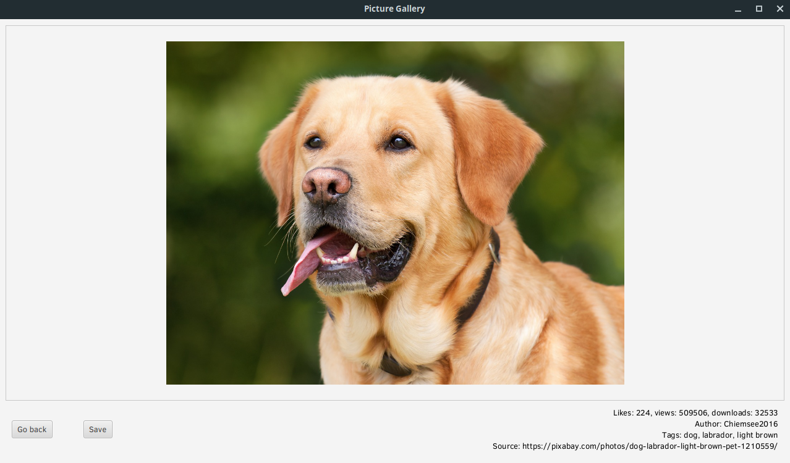

# PicGallery

Picture gallery app that searches images by query and displays them in tiles

## Requirements

In order to run this app you have to install **Java 11**, which you can get from [**here**](https://www.oracle.com/technetwork/java/javase/downloads/index.html "Oracle") or [**here**](https://openjdk.java.net/projects/jdk/ "OpenJDK").

You can download the latest release of the app from [**here**](https://github.com/spietras/PicGallery/releases/tag/v1.0).

---

## Building the app yourself

First you have to acquire API key from Pixabay. You can get it [**here**](https://pixabay.com/api/docs/).

Next you have to put the key in the configuration file at:

```
src/main/resources/app.conf
```
Make sure you have `JAVA_HOME` set to correct JDK path and run:
```
./gradlew run
```
or if you want to make .jar:
```
./gradlew jar
```
(Note: the .jar will only work on the OS it was compiled on)

---

## How to use

It's pretty straightforward.

Type your query into the input form and hit the **Search** button. Pictures' previews should be appearing in the area below:


You can hit the search button again to load more pictures. They should also load dynamically when you scroll down or resize the window to not leave empty space.

When some errors occur or all available pictures are loaded, you will be notified about this in the bottom right corner of your screen.

---

You can click on any preview to see details of the picture:



Hold Ctrl and scroll to zoom in and out on the picture and use your mouse to pan around.

In the bottom right corner you can find some info about the picture.

If you liked the picture, you can save it to your computer using the **Save** button. 

You can return to previous screen by using the **Go back** button

